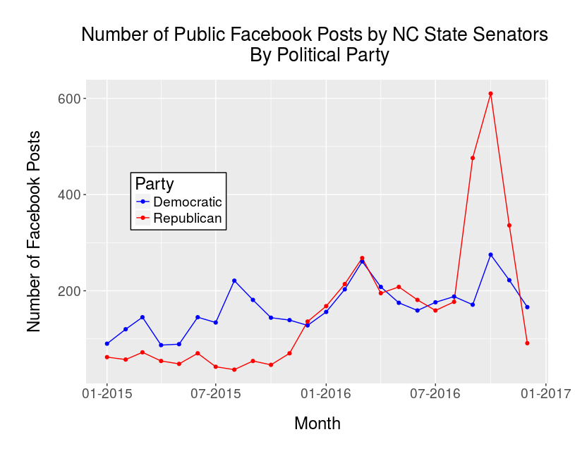
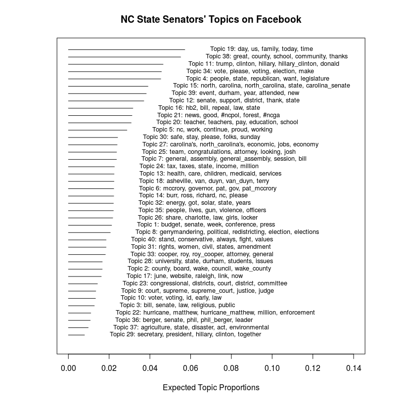
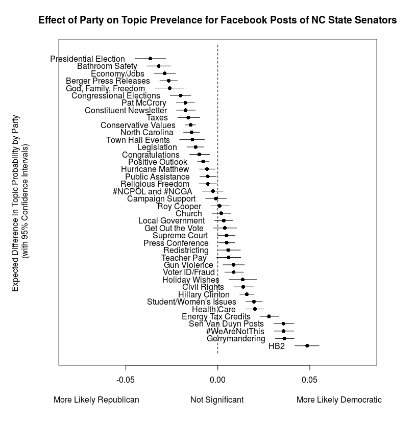
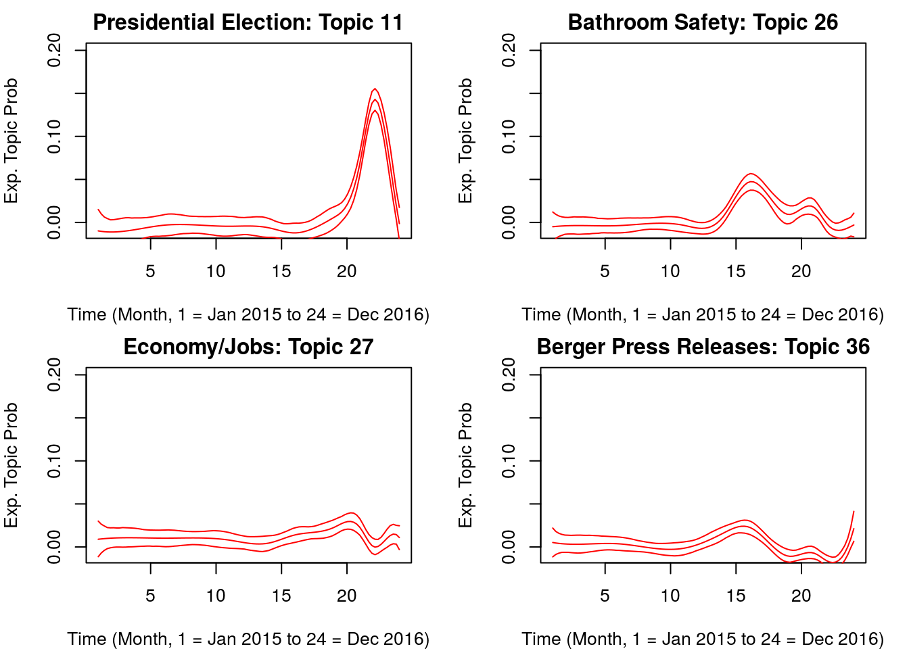
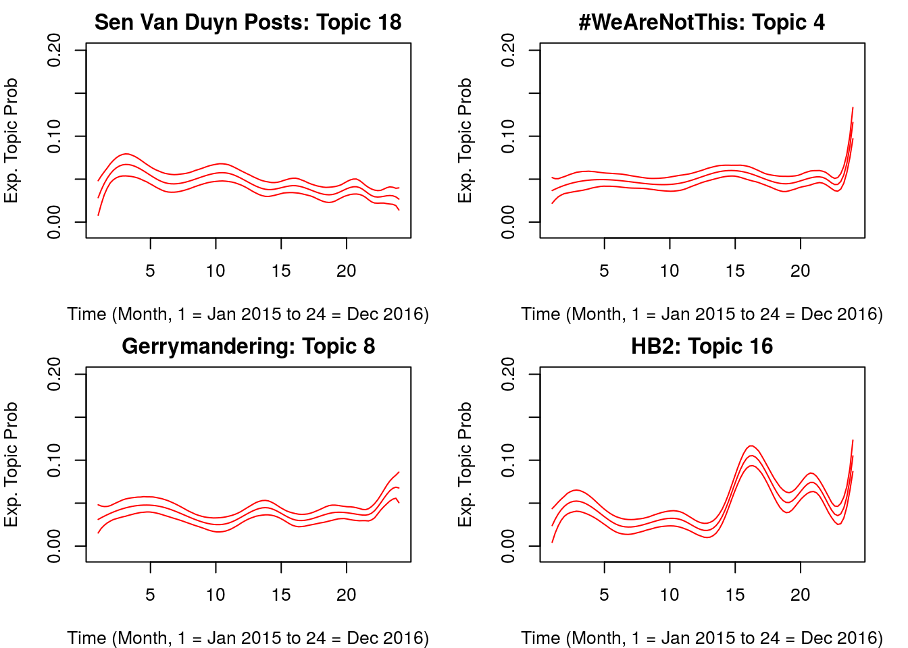
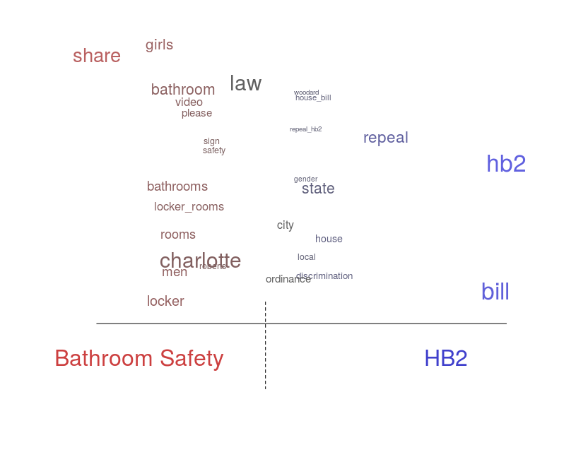

## Introduction

I've created this GitHub respository that analyzes nearly 7,000 Facebook posts by NC State Senators between Jan 2014 to Dec 2016. Specifically, I use [Structural Topic Modeling](http://www.structuraltopicmodel.com/) to identify the topics and estimate the effect party has on each topic's prevalence.

I haven't uploaded the data used onto GitHub but email me if you're interested in the raw data.

See either Part 1 or Part 2 below for the code and commentary.

## HTML Outputs of NC State Senate Facebook Posts

| Part                | Topics                                                          |
| --------------------| --------------------------------------------------------------- |
| Part 1              | [Pre-processing & Exploratory](https://htmlpreview.github.io/?https://github.com/wesslen/NCStateSenateFacebook/blob/master/code/STM-ncsenate-facebook-part1.html)              |
| Part 2   | [Structural Topic Modeling](https://rawgit.com/wesslen/NCStateSenateFacebook/master/code/STM-ncsenate-facebook-part2.html)    |

For the code on how the data was pulled, see the file [pullFacebook.R](code/pullFacebook.R)

## Results

